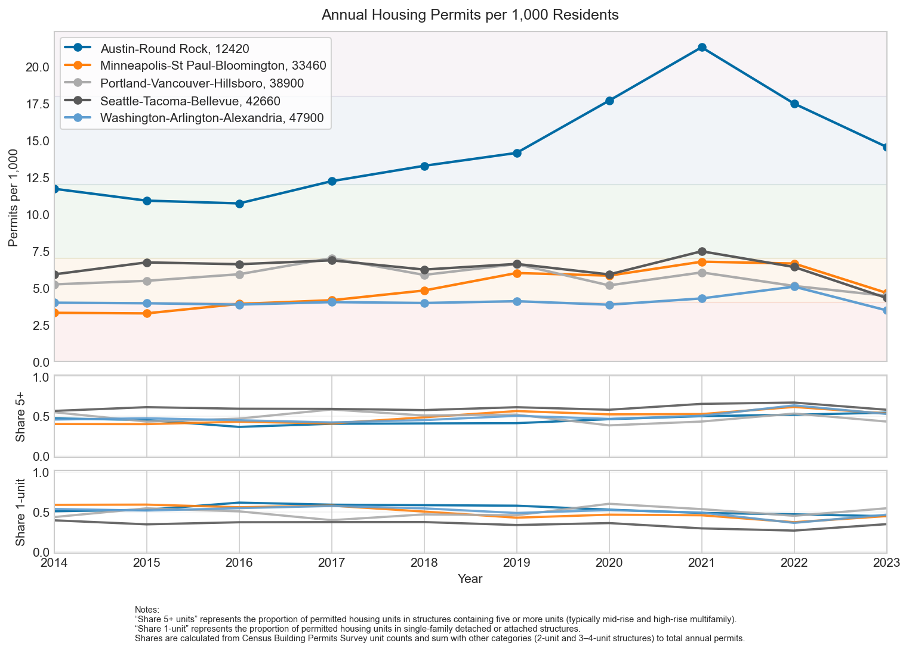
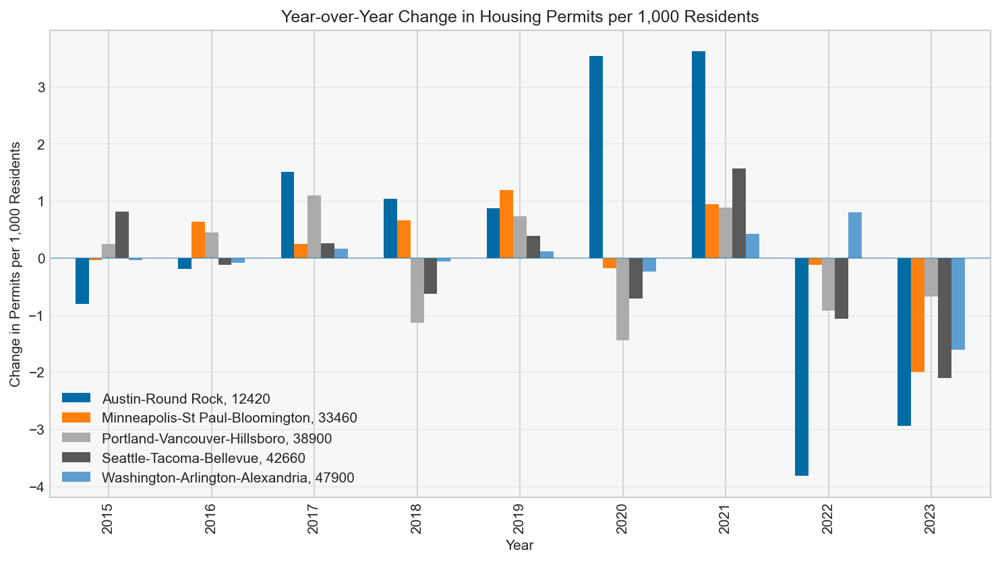

# BLS & Census Housing Analysis
_Reproducible data pipeline and analytical reference using U.S. public datasets_

---

## Overview

This repository provides a reproducible data pipeline and analytical workflow for exploring
metro-level housing supply relative to labor growth using U.S. public datasets.

It implements an **end-to-end ingestion → normalization → analytics pipeline**, producing
queryable Parquet datasets, DuckDB analytical views, and reproducible housing-pressure metrics.

This project treats **Parquet + DuckDB SQL as the primary transformation layer**; Python is used
mainly for orchestration, CLI utilities, and controlled ingestion.

The figures below are illustrative examples generated from the pipeline; users are encouraged to derive their own views using SQL, pandas, or other tools.

---

Charts


Annual Permits                   |   Year-over-Year Change in Permits
:-------------------------------:|:-------------------------------:
  | 

---

Primary data sources:
- **Bureau of Labor Statistics (BLS)** — Quarterly Census of Employment and Wages (QCEW)
- **U.S. Census Bureau** — Building Permits Survey (BPS) and Population Estimates

The project is designed as a **reference implementation** for:
- Public-data ingestion and normalization
- Parquet-based analytical workflows
- SQL-first metric derivation using DuckDB
- Transparent, policy-relevant housing indicators

This is **not** a predictive model. The focus is clarity, reproducibility, and extensibility.

v2.1 adds unit-level permit composition (1-unit, 3–4 unit, 5+ unit) to distinguish how housing is being built, not just how much. This enables clearer interpretation of supply responsiveness in constrained metros.

---

## Why This Project Exists

This project began with a practical question:

> How can publicly available labor and housing data be combined to surface structural housing pressure at the metropolitan level?

The resulting pipeline demonstrates how government data — often fragmented, inconsistently formatted, and slow to access — can be transformed into a stable analytical substrate suitable for policy discussion, research, and exploratory analysis.

---

## What This Project Computes

Two complementary metrics are used:

### 1. Annual Housing Pressure (Per‑Capita)
Year‑over‑year change in housing permits per 1,000 residents.

This highlights short‑term supply volatility and permitting responsiveness.

### 2. Cumulative Structural Gap Index
A cumulative ratio of wage growth to housing permit growth, indexed to a base year.

If labor demand grows faster than housing supply over time, the index rises — indicating structural pressure rather than short‑term fluctuation.

These metrics **surface imbalance**; they do not attempt to explain causality or pricing.

---

## Data Philosophy

This repository follows a **derived‑data‑first** approach:

- **Committed Parquet files** represent stable, reproducible analytical inputs
- Notebooks run **without live API calls by default**
- Raw API ingestion is optional and explicitly invoked

This avoids brittle dependencies on government endpoints while preserving a clear path for extending coverage.

---

## Repository Layout

```bash
src/bls_housing/
  ingest/          SQL + Python  logic
  duck.py          DuckDB helpers and execution utilities
  helpers.py       Shared constants and utilities

scripts/
  housing.ipynb    Main analysis notebook (charts & metrics)

data/
  derived/         Committed parquet (authoritative inputs)
  lake/            Optional parquet lake (Hive‑partitioned)
  rebuild.sql      DuckDB schema and view definitions
  TODO             Known data caveats & anomalies

pyproject.toml
```

---

## Data Sources

### BLS — QCEW
- Quarterly metro‑level employment and wage totals
- Accessed via the BLS CEW CSV API
- Aggregation level: metro totals only (MicroSAs excluded)

### Census — Building Permits Survey
- Monthly CBSA‑level housing permits
- Aggregated to annual totals during processing
- 1 Unit and 5 Units+ provide info on how dense the new construction is

### Census — Population Estimates
- Annual CBSA population totals
- Used for per‑capita normalization
- Stored as a committed derived table

---

## Architecture

- CLI-based ingestion (ingest-data)
- Caching to avoid repeated API calls
- Parquet usage for analytics efficiency
- DuckDB as an analytical engine
- Deterministic rebuild (build-data)
- Logging + smoke tests
- Clear separation of raw / derived / analytics layers

---

## Area Classification Notes

- Analysis is limited to **Metropolitan Statistical Areas (MSAs)**
- Classification is sourced from the official BLS QCEW area reference CSV
- Earlier PDF‑based references were removed after validation

Three areas were explicitly removed after confirmation they were reclassified from MSAs to Micropolitan Statistical Areas following the 2020 Census:
- Carbondale–Marion, IL
- Pine Bluff, AR
- East Stroudsburg, PA

OMB announced these changes in July 2023; implementation occurred in 2025.

---

## Getting Started

### Prerequisites
- Python 3.10+
- Poetry

### Install & Load Derived Data
```bash
poetry install
poetry run build-data
```

This loads committed Parquet data into DuckDB and creates analytical views.

### Run Analysis
Open and execute:
```bash
scripts/housing.ipynb
```

No external API calls are required for the default workflow.

---

## Optional: Build a Parquet Lake

If you want full raw‑data coverage or wish to publish results to object storage:

```bash
poetry run build-parquet-lake
```

This converts cached raw files into a Hive‑partitioned Parquet lake under `data/lake/`.

The lake can be queried locally or via S3‑compatible storage (MinIO, AWS S3).

Example DuckDB query:
```sql
SELECT
  cbsa_code,
  year,
  quarter,
  COUNT(*) AS rows
FROM read_parquet(
  's3://housing-lake/bls/**/**/*.parquet',
  hive_partitioning=1
)
GROUP BY cbsa_code, year, quarter;
```

---

## Extending the Data

To analyze additional years or metros:

1. Run the ingest pipeline to fetch missing raw data
2. Rebuild derived Parquet outputs
3. Re‑run `build-data` to refresh analytical views

This preserves reproducibility while allowing controlled expansion.

---

## Notes & Caveats

- Some metros have incomplete historical coverage
- Small base‑year permit counts can amplify ratios
- Known anomalies are tracked in `data/TODO`

---

## Changelog

- Migrated to derived‑data‑first workflow
- Removed live‑API dependency from notebooks
- Added per‑capita normalization
- Introduced Parquet lake as optional extension
- Clarified scope and classification logic
- Added architecture section
- Added permits density data to the permits chart

Last updated: 2026‑02‑06
